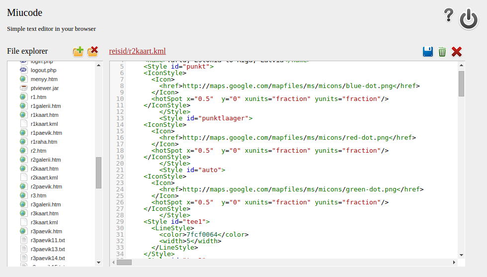
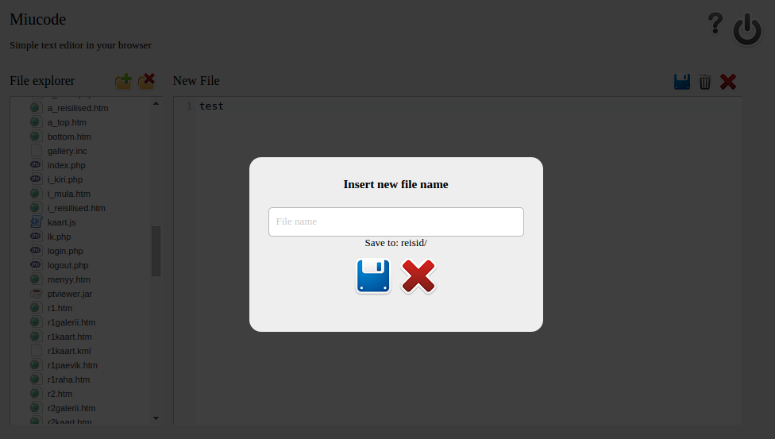

miucode-0.2.beta
================

* Miucode - Simple text editor in your browser
* Current version: 0.2 Beta
* Release date: 04.10.2010.
* Author: Mihkel Oviir
* License: Look for license.txt in program folder
 
## Usage ##
1. Download packed .zip
2. Unpack it.
3. Upload content to web server using ftp client or similar
4. Edit config.php file to suit your needs
5. Happy scripting in your browser!

## Screenshots

